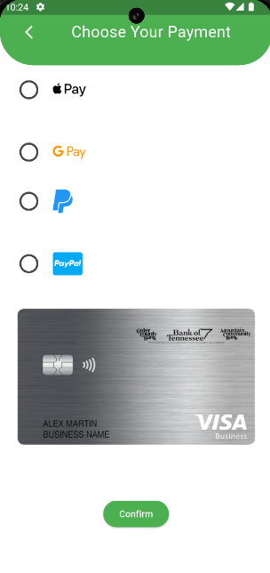

# Quickspot

A simple app with an idea of finding parking spots and booking slots for parking.It uses provider for statemanagent and have real time user locatons that we can search and also get current location

## Features
- Search real time locations
- View parking spaces
- see/book slots for parking
- current location

## App features
- Geolocator
- Flutter maps
- Provider for state Management

## Getting Started

This project is a starting point for a Flutter application.

A few resources to get you started if this is your first Flutter project:

- [Lab: Write your first Flutter app](https://docs.flutter.dev/get-started/codelab)
- [Cookbook: Useful Flutter samples](https://docs.flutter.dev/cookbook)

For help getting started with Flutter development, view the
[online documentation](https://docs.flutter.dev/), which offers tutorials,
samples, guidance on mobile development, and a full API reference.

## Screenshots

